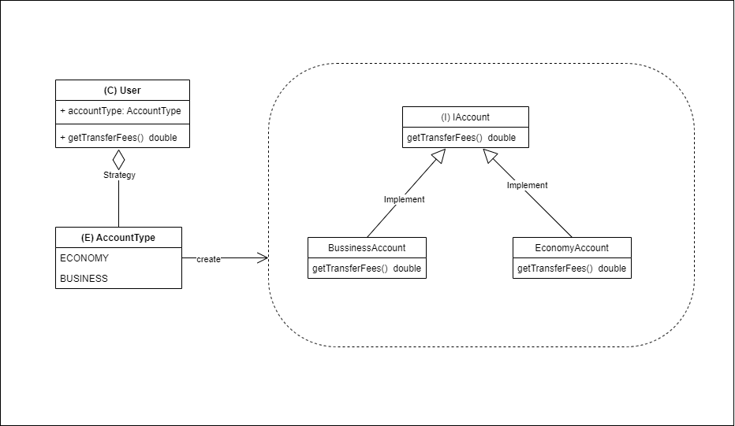
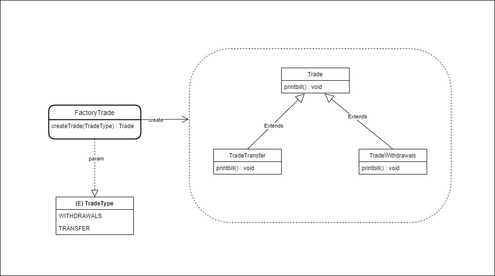
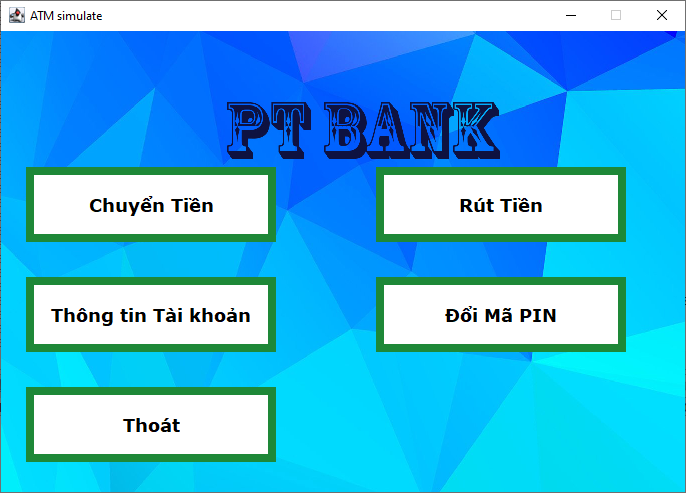
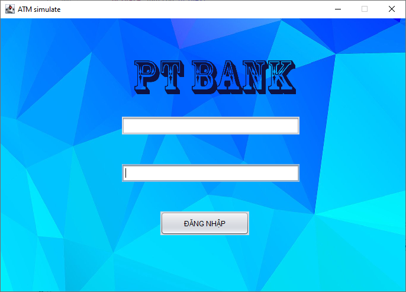
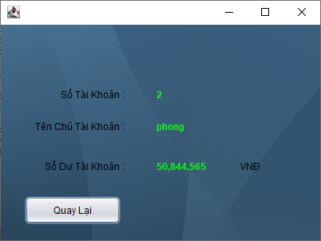
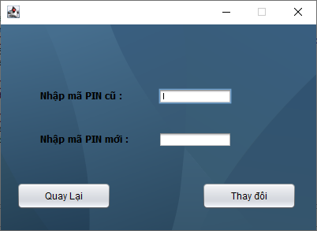
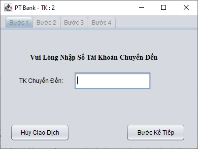
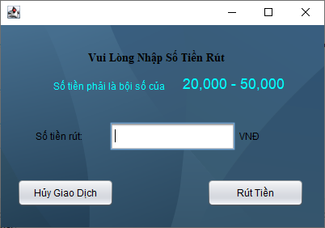

# ATM-System
## Dự án mô phỏng máy ATM sử dụng giao diện Java Swing ,hướng đến kĩ thuật lập trình OOD.

1. [Các Design Pattern](#Pattern)
2. [Các chức năng](#function)

## 1. Các Design Pattern
### AccountStrategy

### TradeFactory

## 2. Các chức năng

### 1) Đăng nhập 

### 2) Xem thông tin tài khoản

### 3) Thay đổi mật khẩu

### 4) Chuyển tiền

### 5) Rút tiền

